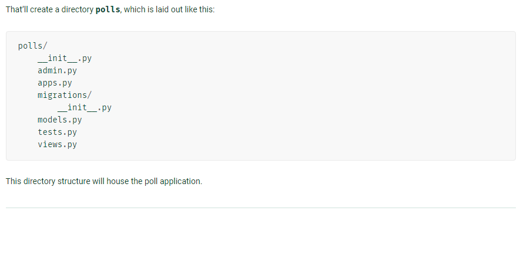

### In this Part U will Learnt about How to connect Our APP With our project. And what is App And the Project in Django.
* **I Hope that You Guys had Read the previous instructions carefully, Now we are moving to our next part i.e. Connecting the project with APP.**

### Creating the APP

#### Here same case for naming, we can choose any name for our app, For example in case of project my project name is my_site, lets say here i am using the name of my app is polls.
## To create an APP we have to write `python manage.py startapp polls`in our cmd window, Here startapp plays the same role as startproject plays in case of creating the name of our project
#### `python manage.py startapp polls`
 **The output will be like this :--**
 
