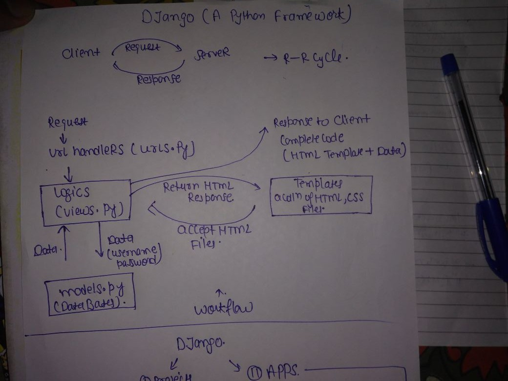
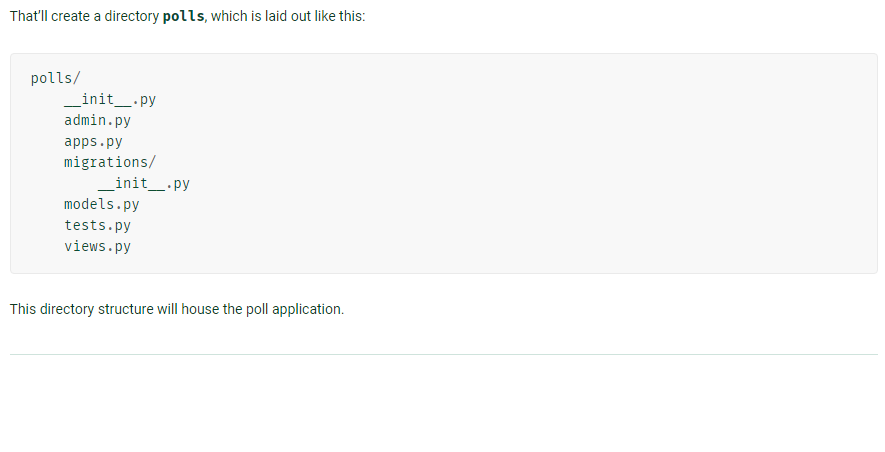

## **I Hope that You Guys had Read the previous instructions carefully, Now we are moving to our next part i.e. Workflow For Request Response Cycle in Django. & Connecting the project with APP.**

### **Let's Have A Rough Idea That How Request Response Cycle Works In Django. How Request is Generated Via Client And how It returns data and template to the client.**

##               <-------Workflow Explanation --------->
#### It all starts with a request. The request reaches to the controller(The  controller is responsible for grabbing all of the necessary building blocks and organizing them as necessary.)Those building blocks are known as models.(models help the controller to retrieve all of the information it needs from the database.) So the request comes in the form of Response to the Client.The final product is known as the view.(Complete code i.e Template + Data).The view is the final page the user sees in their browser.

### Creating the APP

#### Here same case for naming, we can choose any name for our app, For example in case of project my project name is mysite, lets say here i am using the name of my APP is polls.
### To create an APP we have to write `python manage.py startapp polls`in our cmd window, Here startapp plays the same role as startproject plays in case of creating the name of our project
#### `python manage.py startapp polls`
 **The output will be like this :--**
 

#### Now Configure the Urls in File (Urls.py) For Your Logic in (Views.py) And Create the Data Model(models.py) And Map Urls to Views.

#### When a user makes a request for a page on your web app, Django controller takes over to look for the corresponding view via the url.py file, and then return the HTML response or a 404 not found error, if not found. In url.py, the most important thing is the "urlpatterns" tuple. It’s where you define the mapping between URLs and views.

#### **[To get more information regarding Urls in Django Visit here.....](https://www.tutorialspoint.com/django/django_url_mapping.htm)**

### <--- What is MVC/MVT Model Architecture in Django ---> ??  [Check this for more info....](https://djangobook.com/model-view-controller-design-pattern/)

#### Broadly, Django Follows  `MVC (Model View Controller) architecture` closely enough to be called an MVC framework. *Django has been referred to as an MTV framework because the controller is handled by the framework itself and most of the excitement happens in models, templates and views.* However, Django calls these pieces by different names. The four pieces to understand for Django are:--> *URL patterns, views, models, and templates.*. Each of these pieces has a separate role.

##### * The URL patterns take the path of a request and decide, which views should handle the request.The patterns for our project are defined in folder  `mysite/urls.py`. Give a request, the URL patterns pass control to the views.

##### * Views are the logic layer of the program, which are pythons functions that take a request and return an HTTP response.Our views are defined in folder `polls/views.py`.

#### * Each view can use the models,which we have defined in folder  `polls/models.py` to query the database as needed.Each view relies on a corresponding template(HTML+CSS) to help with the presentation layer of what the HTML will look like. Each template is a separate file that consists of HTML with some extra template syntax.

##### We haven't created any templates yet, but they will live in the `mysite/templates` folder.

#### <---- Diffrence btw MVC and MVT ---->

### In **MVT**, a request to a URL is dispatched to a View. This View calls into the Model, performs manipulations and prepares data for output. The data is passed to a Template that is rendered an emitted as a response. ideally in web frameworks, the controller is hidden from view.

### Whereas in **MVC**, the user interacts with the GUI, the controller handles the request and notifies the model and the view queries the model to display the result to the user.
