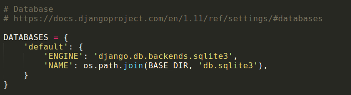
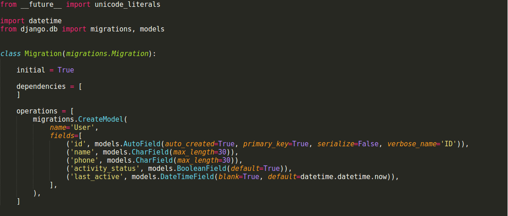
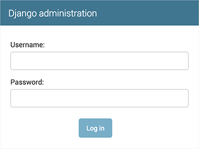

### **I Hope that You Guys had Read the previous instructions carefully, Now we are moving to our next part i.e. Workflow For Request Response Cycle in Django. & Connecting the project with APP.**


#### **Let's Have A Rough Idea That How Request Response Cycle Works In Django. How Request is Generated Via Client And how It returns data and template to the client.**


##               <-------Workflow Explanation --------->
##### It all starts with a request. The request reaches to the controller(The  controller is responsible for grabbing all of the necessary building blocks and organizing them as necessary.)Those building blocks are known as models.(models help the controller to retrieve all of the information it needs from the database.) So the request comes in the form of Response to the Client.The final product is known as the view.(Complete code i.e Template + Data).The view is the final page the user sees in their browser.

### Creating the APP

* Here same case for naming, we can choose any name for our app, For example in case of project my project name is mysite, lets say here i am using the name of my APP is polls.
 * To create an APP we have to write `python manage.py startapp polls`in our cmd window, Here startapp plays the same role as startproject plays in case of creating the name of our project
##### `python manage.py startapp polls`
 **The output will be like this :--**

 

### Configuring our APP with Django Project In Settings.py File.

 * To include the APP in our project, we need to add a reference to its configuration class in the `INSTALLED_APPS` setting. For this we have to Edit the `mysite/settings.py` file and add that APP to the INSTALLED_APPS setting. It’ll look like this:

```
mysite/settings.py
INSTALLED_APPS = [
    'polls',
    'django.contrib.admin',
    'django.contrib.auth',
    'django.contrib.contenttypes',
    'django.contrib.sessions',
    'django.contrib.messages',
    'django.contrib.staticfiles',
]
```
Note:- Donot forget to place ' , ' comma After adding the app Name i.e. `polls.`


### DataBase Setup--->

* By default, the django configuration uses SQLite. If you’re new to databases, or you’re just interested in trying Django, this is the easiest choice. SQLite is included in Python, so you won’t need to install anything else to support your database.
* When starting your first real project, however, you may want to use a more scalable database like `PostgreSQL`, `MySql` to avoid database-switching headaches down the road.
##### [Installation Guide For Installing MySql For Windows ..Click Here..](https://github.com/avmain/Acadview-Docs/blob/master/docs/How%20to%20install%20MySQL%20in%20Windows.md)
##### [Installation Guide For Installing PostgreSQL For Windows ..Click Here..](https://drive.google.com/file/d/0B6G-YjcSmDxeWkdGUjBDTGwxRzg/view?ths=true)

To do this, we open the settings.py file in mysite directory.
Next, we navigate to the DATABASE dictionary, which looks like this:



##### Now You have to **Change the following keys in the DATABASES** 'default' item to match your database connection settings:


*   **ENGINE** : `'django.db.backends.mysql'`,

 * (Either `'django.db.backends.sqlite3'`,  `'django.db.backends.postgresql'`, `'django.db.backends.mysql'`, or ``'django.db.backends.oracle'`` Depending Upon Your Choice.)

* **NAME** : `'acadview_db'`

 * (The name of your database. If you’re using SQLite, the database will be a file on your computer; in that case, NAME should be the full absolute path, including filename, of that file. The default value, `os.path.join(BASE_DIR, 'db.sqlite3')`, will store the file in your project directory.)
###### **Note:-** If you are not using SQLite as your database, additional settings such as USER, PASSWORD, and HOST must be added.

* **'USER'** : `'root'`

 * (The name that you wrote while creating the connection.In case of mysql by default is is root.u can change if u wanna to change.)

* **'PASSWORD'** : `'Your password here'`

 * (The password you entered while creating the connection.**Must Remember**)

* **'HOST'** : `'127.0.0.1'` or `'localhost'`

 * (For testing on ur system.u can change it further)

* **'PORT'** : `'3306'`

 * (Port for mysql database is by default set at 3306, there is no need to change it.)

```

DATABASES = {
    'default': {
        'ENGINE': 'django.db.backends.mysql',
        'NAME': 'acadview_db',
        'USER': 'root',
        'PASSWORD': 'your password here',
        'HOST': 'localhost',
        'PORT': '3306',
    }
}

```

###### [MySQL-Django configuration for Windows...Check here..](https://docs.google.com/document/d/1tUnpcf_u40-XZdnjNjCPpkvV_8UvLkJ9QW8mcGwRvAY/edit)

### Django Preinstalled APPS.
```
By default, INSTALLED_APPS contains the following apps, all of which come with Django:

django.contrib.admin – The admin site. we will use it shortly.
django.contrib.auth – An authentication system.
django.contrib.contenttypes – A framework for content types.
django.contrib.sessions – A session framework.
django.contrib.messages – A messaging framework.
django.contrib.staticfiles – A framework for managing static files.

These applications are included by default as a convenience for the common case.

```
### Edit Settings
Since we’ve generated the skeleton project, we now have a `settings.py` file.

**In order for our project(Application) to have the correct time associated with our area, we will edit the** `settings.py` **file so that it will be using your current time zone**. You can use [this list of time zones as a reference....](https://en.wikipedia.org/wiki/List_of_tz_database_time_zones) For our example, we will be using `Asia/Kolkata` time.
Now navigate to the directory where the `settings.py` file is located, open and edit the settings.py file:
We are editing the TIME_ZONE field, so navigate to the bottom section of the file that looks like this:

```
LANGUAGE_CODE = 'en-us'

TIME_ZONE = 'Asia/Kolkata'

USE_I18N = True

USE_L10N = True

USE_TZ = True

```
The files that get served from your Django web application are referred to as static files. This could include any necessary files to render the complete web page, including JavaScript, CSS, and images.

Go to the end of the settings.py file and add `STATIC_ROOT` as shown below:
settings.py
```
# Static files (CSS, JavaScript, Images)

STATIC_URL = '/static/'
STATIC_ROOT = os.path.join(BASE_DIR, 'static')

```
Now that we’ve added the time zone and the path for static files.

**its optional to  add our IP to the list of allowed hosts. Navigate to the line of the settings.py file where it says ALLOWED_HOSTS, it’ll be towards the top of the settings.py file.**
```
...
# SECURITY WARNING: don't run with debug turned on in production!
DEBUG = True

ALLOWED_HOSTS = ['your server IP address']


```
its your choice  you can simply leave it empty.Or Add your server’s IP address between the square brackets and single quotes.
### Creating Models (i.e. Creating DataTable or simply model is just another word for a database table.)
In MySQL you can create a model/table using the basic DDL queries. This is how you do it.
To create a table we do:
```
CREATE TABLE table_name (
    column1 datatype,
    column2 datatype,
    column3 datatype,
   ....
);
```
This requires that we understand another whole new set of syntax, which will depend on which type of database we choose.

###      Django to the rescue!!


* It provides us a much easier way to make and maintain models: migrations.
* Django migrations help you manage any sort of change in your database tables/models.

These changes Are ?
* Creating a table
* Adding/Removing a column from the table
* Updating table/column name
* Removing a table/column

In Django, each model is a Python class. Each attribute of the model class represents a column in the database table.
For this, we open `models.py` from the polls directory.

Let's make the User model/class in `models.py` file :

```
from django.db import models

    class User(models.Model):
      name = models.CharField(max_length=255)
      phone = models.CharField(max_length=30)
      age = models.IntegerField(default=0)
      has_verified_mobile = models.BooleanField(default=False)
      created_on = models.DateTimeField(auto_now_add=True)
```
* For it to be a valid django model class it needs to inherit from `models.Model class` which is included in django. i.e. `from django.db import models`

* The models class has already defined some commonly used data or field types. For name we will be using the `CharField`.

* Here we want our name attribute or column to not have more than 255 characters, we specify that using max_length parameter. We can also add a integer type field for age of user.

* Django ORM provides us the IntegerField.

* We added a default value for age to be 0 for all users in case the user does not provide for it.
We can also add a date time field for when the user created the account.Django ORM provides us with the DateTimeField.

Setting auto_now_add attribute to True tells django whether it should automatically add a date of the current time when a new user is created or it.

[You Guys Can also check Django model fields by clicking here....](https://docs.djangoproject.com/en/1.11/ref/models/fields/)

### Migrate the Database and Test your Project
We just created the python class And the Django settings are configured, but the database table hasn't been created till now. Now that we can migrate our data structures to our database and test out the server.

We can begin by applying migrations to our database.

To create migrations we just need to run the following command:

`python manage.py makemigrations polls`

This is what makemigrations command did for us, all by itself:



Note :- Django automatically adds primary key to the models that we create if we haven't mentioned it.
By running `makemigrations`, **you’re telling Django that you’ve made some changes to your models and that you’d like the changes to be stored as a migration**.

Migrations are how Django stores changes to your models (and thus your database schema) - they’re just files on disk.

**The changes have only been recorded but the database hasn't been modified till now**. We need to run `migrate` to actually create those model tables in your database:
`python manage.py migrate`

```
python manage.py migrate
Operations to perform:
  Apply all migrations: admin, auth, contenttypes, polls, sessions
Running migrations:
  Rendering model states... DONE
  Applying polls.0001_initial... OK

```
Now whenever you are updating ur database by performing CRUD (create, read, update , delete) operations everytime you have to follow the steps.
* Change your models (in models.py).
* Run `python manage.py makemigrations polls` to create migrations for those changes
* Run `python manage.py migrate` to apply those changes to the database.

The reason that there are separate commands to make and apply migrations is because you’ll commit migrations to your version control system and ship them with your app; they not only make your development easier, they’re also useable by other developers and in production.

### What is Django ORM ??
An object-relational mapper (ORM) is a code library that automates the transfer of data stored in relational databases tables into objects that are more commonly used in application code.
ORMs provide a high-level abstraction upon a relational database that allows a developer to write Python code instead of SQL to create, read, update and delete data and schemas in their database. Developers can use the programming language they are comfortable with to work with a database instead of writing SQL statements or stored procedures.

### Introducing the Django Admin
After creating the database structure, we can create an administrative account by typing:
`python manage.py createsuperuser`
You will be asked to select a username, provide an email address, and choose and confirm a password for the account.

Enter your desired username and press enter.
`Username: admin`
You will then be prompted for your desired email address:
`Email address: admin@example.com`
The final step is to enter your password. You will be asked to enter your password twice, the second time as a confirmation of the first.
`Password: **********`
`Password (again): *********`

Superuser created successfully.
### Start the development server:
The Django admin site is activated by default.Once you have an admin account set up, you can test that your database is performing correctly by starting up the Django development server:
`python manage.py runserver`
In your web browser, visit your server's domain name or IP address followed by :8000 to reach default Django root page.You should see the default index page:


Now, Append `/admin` to the end of the URL and you should be able to access the login screen to the admin interface: http://127.0.0.1:8000/admin/. You should see the admin’s login screen:



### Enter to the admin site
Now, try logging in with the `superuser` account you created in the previous step. You should see the Django admin index page:


You should see a few types of editable content: groups and users. They are provided by `django.contrib.auth`, the authentication framework shipped by Django.
By accessing the admin interface, we have confirmed that our database has stored our user account information and that it can be appropriately accessed.


##### Now Configure the Urls in File (Urls.py) For Your Logic in (Views.py) And Create the Data Model(models.py) And Map Urls to Views.

*  When a user makes a request for a page on your web app, Django controller takes over to look for the corresponding view via the url.py file, and then return the HTML response or a 404 not found error, if not found. In url.py, the most important thing is the "urlpatterns" tuple. It’s where you define the mapping between URLs and views.

##### **[To get more information regarding Urls in Django Visit here.....](https://www.tutorialspoint.com/django/django_url_mapping.htm)**

#### <--- What is MVC/MVT Model Architecture in Django ---> ??  [Check this for more info....](https://djangobook.com/model-view-controller-design-pattern/)

* Broadly, Django Follows  `MVC (Model View Controller) architecture` closely enough to be called an MVC framework. *Django has been referred to as an MTV framework because the controller is handled by the framework itself and most of the excitement happens in models, templates and views.* However, Django calls these pieces by different names. The four pieces to understand for Django are:--> *URL patterns, views, models, and templates.*. Each of these pieces has a separate role.

 * The URL patterns take the path of a request and decide, which views should handle the request.The patterns for our project are defined in folder  `mysite/urls.py`. Give a request, the URL patterns pass control to the views.

 * Views are the logic layer of the program, which are pythons functions that take a request and return an HTTP response.Our views are defined in folder `polls/views.py`.

 * Each view can use the models,which we have defined in folder  `polls/models.py` to query the database as needed.Each view relies on a corresponding template(HTML+CSS) to help with the presentation layer of what the HTML will look like. Each template is a separate file that consists of HTML with some extra template syntax.

##### We haven't created any templates yet, but they will live in the `mysite/templates` folder.


### <---- Diffrence btw MVC and MVT ---->

* In **MVT**, a request to a URL is dispatched to a View. This View calls into the Model, performs manipulations and prepares data for output. The data is passed to a Template that is rendered an emitted as a response. ideally in web frameworks, the controller is hidden from view.

 * Whereas in **MVC**, the user interacts with the GUI, the controller handles the request and notifies the model and the view queries the model to display the result to the user.
