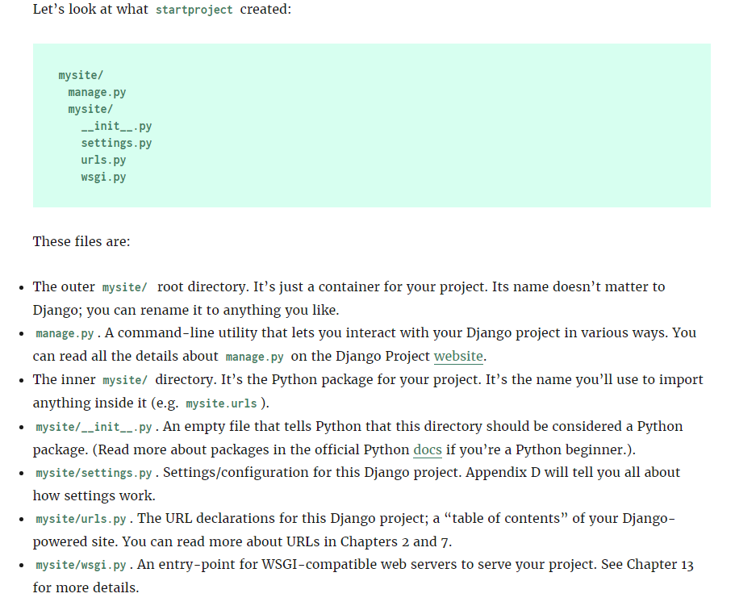

### **Django is a high-level Python Web framework that encourages rapid development and clean, pragmatic design. Built by experienced developers, it takes care of much of the hassle of Web development, so you can focus on writing your app without needing to reinvent the wheel. It’s free and open source.**

* ### Django was designed to help developers take applications from concept to completion as quickly as possible.
* ### Django takes security seriously and helps developers avoid many common security mistakes.
* ### Some of the busiest sites on the Web leverage Django’s ability to quickly and flexibly scale.

### *There are two very important things you need to do to get started with Django:*

#### 1. Install Django (obviously); and
#### 2. Get a good understanding of the Model-View-Controller (MVC) design pattern.

#### ``The first, installing Django, is really simple and The second is just as important, especially if you are a new programmer or coming from using a programming language that does not clearly separate the data and logic behind your website from the way it is displayed .Because understanding MVC will make understanding Django so much easier.``

## Installing Django-->

##### Before you can start learning how to use Django, you must have to satisfy the following needs.

##### 1. Install Python.(Ignore it if already installed.)
##### 2. Install a Python Virtual Environment.(Optional but still U have to Prefer it for better convinience.)
###### 3. Install Django.(Compulsary)

### Installing Python

##### Django itself is written in Python, so the first step in installing the Django framework is to make sure you have Python installed.

* #### Python Versions Compatible Are 2.7, 3.4, 3.5 and 3.6.

### Installing a Python Virtual Environment  
* #### **All of the software on your computer operates interdependently – each program has other bits of software that it depends on (called dependencies) and settings that it needs to find the files and other software it needs to run (call environment variables).**
* #### **When you are writing new software programs, it’s possible (and common!) to modify dependencies and environment variables that your other software depends on. This can cause numerous problems, so should be avoided.**

### *A Python virtual environment Rescues or solves this problem by wrapping all the dependencies and environment variables that your new software needs into a file system separate from the rest of the software on your computer.*

**The virtual environment tool in Python is called ``virtualenv`` and we install it from the command line using pip:**

#### `pip install virtualenv`

after that write some decription for name of virtualenv

## Installing Django

#### Now that we have Python and are running a virtual environment, installing Django is super easy, just type the command:

### `pip install django`

Note:- This will instruct pip to install Django into your virtual environment. Your command output should look like this:

Or if u Already installed It it shows like :

### Starting a Project-->

#### Once you’ve installed Python, you can take the first step in developing a Django application by creating a project. *A project is a collection of settings for an instance of Django.* If this is your first time using Django, you’ll have to take care of some initial setup.

#### `Remember:-I am assuming at this stage you are still running the virtual environment from the previous installation step. "If not, you will have to start it again with virtualenvFolder\Scripts\activate\."  Also make sure you are in the mysite_project directory.`

### From your virtual environment command line, run the following command:

#### `django-admin startproject mysite`

This command will automatically create a mysite directory in your project directory as well as all the necessary files for a basic.

