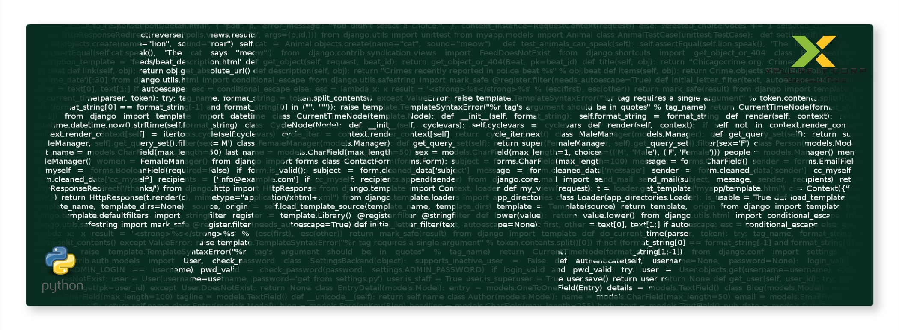
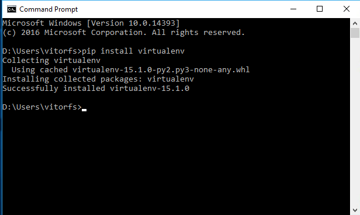
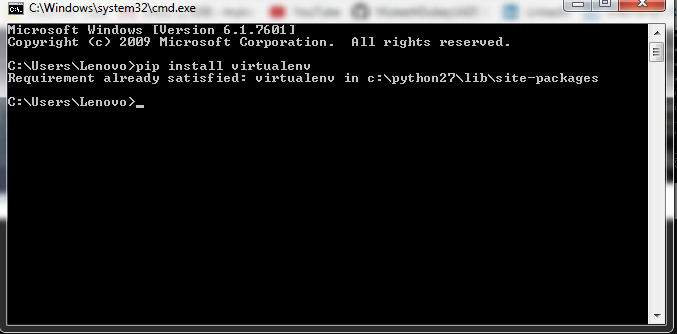
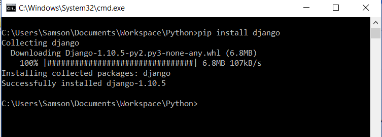
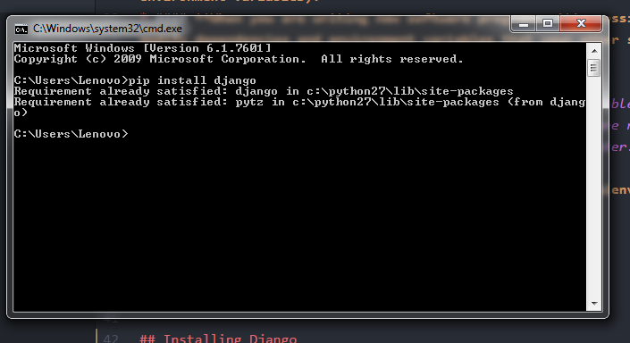
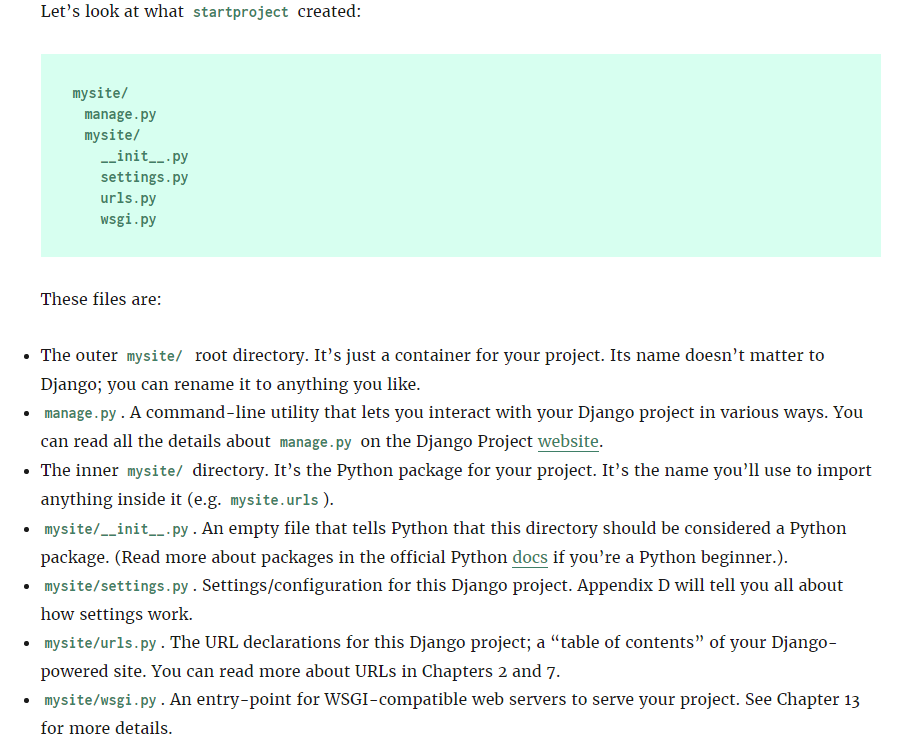
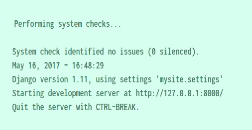
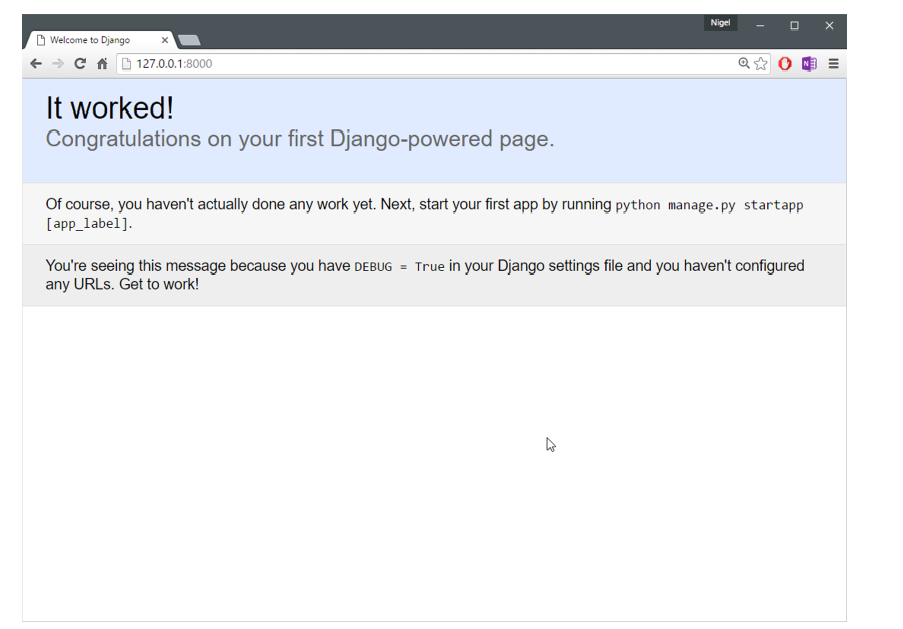

### **Django is a high-level Python Web framework that encourages rapid development and clean, pragmatic design. Built by experienced developers, it takes care of much of the hassle of Web development, so you can focus on writing your app without needing to reinvent the wheel. It’s free and open source.**

#### * Django was designed to help developers take applications from concept to completion as quickly as possible.
#### * Django takes security seriously and helps developers avoid many common security mistakes.
#### * Some of the busiest sites on the Web leverage Django’s ability to quickly and flexibly scale.

#### *There are two very important things you need to do to get started with Django:*

#### 1. Install Django (obviously); and
#### 2. Get a good understanding of the Model-View-Controller (MVC) design pattern.

#### `The first, installing Django, is really simple and The second is just as important, especially if you are a new programmer or coming from using a  programming language that does not clearly separate the data and logic behind your website from the way it is displayed .Because understanding MVC will make understanding Django so much easier.`


# **Installing The Django Framework**-->

### Before you can start learning how to use Django, you must have to setup the following needs.

##### 1. Install Python.(Ignore it if already installed.)
##### 2. Install a Python Virtual Environment.(Optional but still U have to Prefer it for better convinience.And To prevent from Conflicts.)
##### 3. Install Django.(Compulsary)

### Installing Python-->

##### Django itself is written in Python, so the first step in installing the Django framework, is to make sure you have Python installed In your System.

#### *Python Versions Compatible Are 2.7, 3.4, 3.5 and 3.6.*

### Installing a Python Virtual Environment-->
#### **All of the software on your computer operates interdependently – each program has other bits of software that it depends on (called dependencies) and settings that it needs to find the files and other software it needs to run (call environment variables).**

#### **When you are writing new software programs, it’s possible (and common!) to modify dependencies and environment variables that your other software depends on. This can cause numerous problems, so should be avoided.**

### *A Python virtual environment Rescues or solves this problem by wrapping all the dependencies and environment variables that your new software needs into a file system separate from the rest of the software on your computer.*

#### *Various Steps are there For Implementing Virtual Environment in our project:-

* **Installing Virtual Environment(`pip install virtualenv`).**
* **Connect our project with our Environment(create a directory with the same name as our virtual environment in our preferred development folder.)**
* **Set Project Directory(bind our virtualenv with our current working directory.)**
* **activate(activate this environment by moving into Virtual Environment Directory via cmd window, Inside the Script folder ,Run the activate command)**.
* **Deactivate(type ‘deactivate’ to deactivate your environment.)**
#### `Note:-` Did Not Forget To configure ur python Interpretur To Virtual environment interpretur. You can set it by moving into settings option in your IDLE.

#### **The virtual environment tool in Python is called ``virtualenv`` and we install it from the command line using pip:**

#### `pip install virtualenv`
**See The Output on Command Window :**


**In Case You Already Installed :**


### Create an Environment with virtualenv-->
#### The next step is to create the environment with virtualenv:
#### `virtualenv My_Project_Env`     

its all depend upon u that what do u want to set the name of ur virtual environment.
### Activating environment:
```
C:\Users\user\Documents>My_Project_Env\Scripts\activate
(My_Project_Env) C:\Users\user\Documents>

```
#### Now install the packages and Libraries U wanna To use in your project Make sure before coding u must have to activate your virtual environment.and if u install a library without Activating the environment it will be installed it on ur system not on environment.So make sure to activate the environmentbefore installing the supportive library

## Installing Django

#### Now that we have Python and are running a virtual environment, installing Django is super easy, just type the command:

### `pip install django`

Note:- This will instruct pip to install Django into your virtual environment. Your command output should look like this:


Or if u Already installed It it shows like :



### Starting a Project-->

#### Once you’ve installed Python, you can take the first step in developing a Django application by creating a project. *A project is a collection of settings for an instance of Django.* If this is your first time using Django, you’ll have to take care of some initial setup.

#### `Remember:-I am assuming at this stage you are still running the virtual environment from the previous installation step. "If not, you will have to start it again with virtualenvFolder\Scripts\activate\."  Also make sure you are in the mysite_project directory.`

### From your virtual environment command line, run the following command:

#### `django-admin startproject mysite`

**This command will automatically create a mysite directory in your project directory as well as all the necessary files for a basic.:**



### Setting Up a Database-->

#### Django includes a number of applications by default (For Example: The admin program and user management and authentication).
#### Some of these applications make use of at least one database table, so we need to create tables in a database before we can use them. To do that, move into your Project Directory i.e. mysite folder created in the last step (type cd mysite at the command prompt) and run the following command:
### `python manage.py migrate`

#### The migrate command looks at all your available models and creates tables in your database for whichever tables don’t already exist, as well as optionally providing much richer schema control.Or simply we can say that The `migrate` command creates a `new SQLite database and any necessary database tables according to the settings file created by the startproject command` (more on the settings file later in the book). If all goes to plan,
**you’ll see a message for each migration it applies:**



### The Development Server-->

#### Let’s verify your Django project works. Change into the outer mysite directory, if you haven’t already, and run the following commands:
### `python manage.py runserver `
**You’ll see the following output on the command line:**


##### You’ve started the Django development server, a lightweight Web server written purely in Python. Django’s creators included this with Django so you can develop things rapidly, without having to deal with configuring a production server – such as Apache – until you’re ready for production.

### Now’s a good time to note: `Don't use this server in anything resembling a production environment.` It’s intended only for use while developing.

### Now that the server’s running, visit http://127.0.0.1:8000/ with your Web browser(On Local Host Port 8000, U will change the port According to ur need).
### `Note` :- Changing the port

#### By default, the runserver command starts the development server on the internal IP at port 8000.

#### If you want to change the server’s port, pass it as a command-line argument. For instance, this command starts the server on port 8080:
#### `python manage.py runserver 8080`

**You’ll see a “Welcome to Django” page in pleasant, light-blue pastel**


## It Worked....
